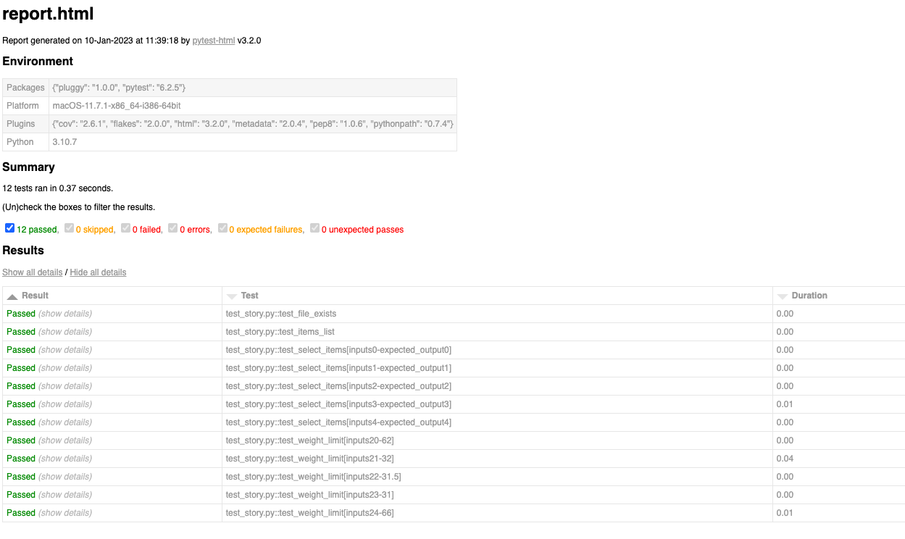

# testing-intro

## Description

We were tasked to write a few tests (pytest) for our command line story project. The tests I wrote ensured that (1) the log file was created, (2) the items list was the correct length, (3) the user's selected items were appended correctly, and (4) the weight limit was changed correctly according to the item selected and quantity selected.

